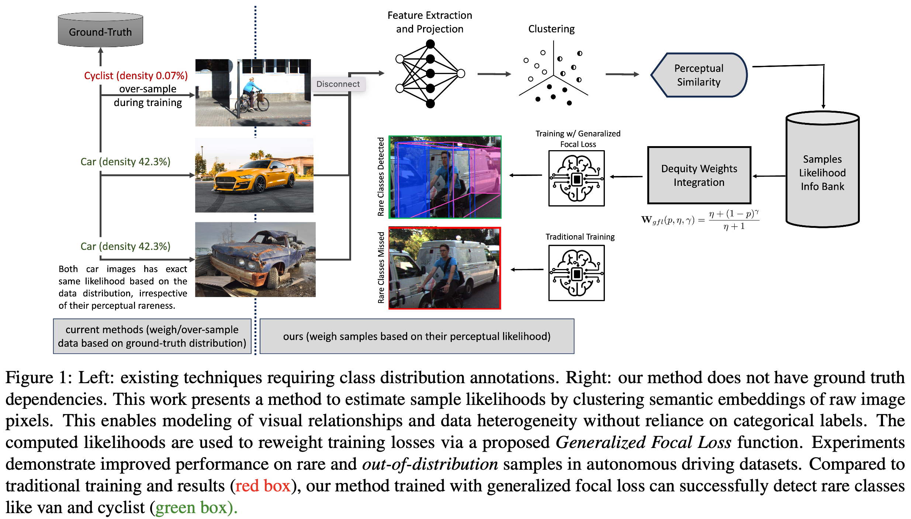

# DatasetEquity: Are All Samples Created Equal? In The Quest For Equity Within Datasets

*This is the official implementation of the ICCV 2023 Workshop paper: [DatasetEquity: Are All Samples Created Equal? In The Quest For Equity Within Datasets](https://arxiv.org/abs/2308.09878).*

This paper presents a novel method for addressing data imbalance in machine learning. The method computes sample likelihoods based on image appearance using deep perceptual embeddings and clustering. It then uses these likelihoods to weigh samples differently during training with a proposed **Generalized Focal Loss** function. This loss can be easily integrated with deep learning algorithms. Experiments validate the method's effectiveness across autonomous driving vision datasets including KITTI and nuScenes. The loss function improves state-of-the-art 3D object detection methods, achieving over 200% AP gains on under-represented classes (Cyclist) in the KITTI dataset. The results demonstrate the method is generalizable, complements existing techniques, and is particularly beneficial for smaller datasets and rare classes.



## [Getting Started](docs/getting_started.md)

## TL;DR

The concept of this paper is simple: (1) Quantify the likelihood of occurrence for each sample in the training dataset (2) Compute **Generalized Focal Loss** based on the likelihoods (3) Train the model with the new weighted loss function.

**Generalized Focal Loss** requires computing a loss weight for each sample, called *Dequity Weight*, and can be computed as follows:

```python
def dequity_loss_weight(self, p: float, 
                              eta: float=1.0, 
                              gamma: float=5.0
    ) -> float:
    """Calculate the Dquity Weight.
    Args:
        p (float): The probability of the sample.
        eta (float): The parameter to control the weight.
        gamma (float): The parameter to control the weight.
    Returns:
        float: The dequity loss weight.
    """
    return (eta + (1 - p) ** gamma) / (eta + 1)
```

The pseudo-code for the training algorithm is as follows:

```python
for sample in dataloader:
    # retrieve the sample likelihood
    p = get_sample_likelihood(sample)
    # compute the DEquity weight
    w = dequity_loss_weight(p)
    # forward pass
    y_hat = model(sample)
    # compute the loss
    loss = loss_fn(y_hat, sample)
    # compute the weighted loss
    weighted_loss = w * loss   <-- Generalized Focal Loss (Our Contribution)
    # backward pass
    weighted_loss.backward()
```

Sample likelihoods are computed beforehand. Please refer to the [Getting Started](docs/getting_started.md) guide for more details.

## Citation

If you find this work useful for your research, please cite our paper:

```
@inproceedings{shrivastava2023datasetequity,
  title={DatasetEquity: Are All Samples Created Equal? In The Quest For Equity Within Datasets},
  author={Shrivastava, Shubham and Zhang, Xianling and Nagesh, Sushruth and Parchami, Armin},
  booktitle={Proceedings of the IEEE/CVF International Conference on Computer Vision (ICCV) Workshops},
  year={2023}
}
```
